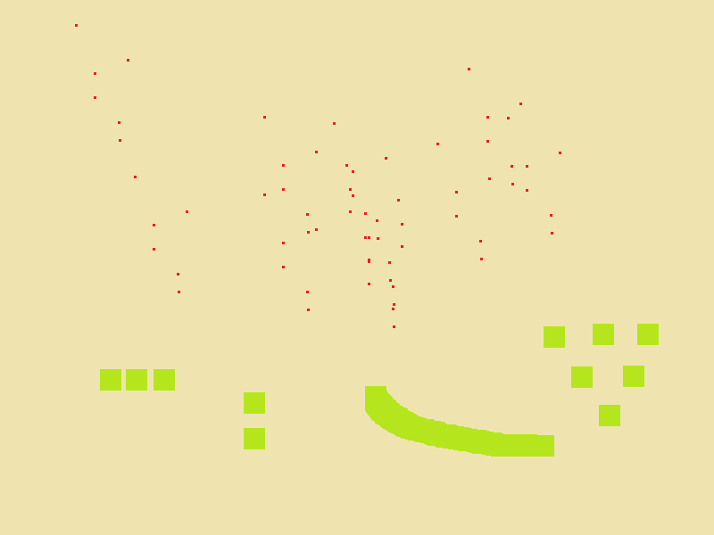

# Music Bounce #

An experimental musical instrument.

by Andrew Dempsey ([andrewdempsey2016@gmail.com](andrewdempsey2016@gmail.com))

*Image 1. Main simulation screen*

**Controls**

Middle mouse / number keys - make selection
Left Mouse - place selection

Place different coloured shapes and red dots in the playfield. When ready plress the space bar to run the simulation.

The red dots will fall, striking the different coloured shapes, creating music.
----------

Built built using SFML 2.5.1

[https://www.sfml-dev.org/](https://www.sfml-dev.org/)
----------
Compiled with MinGW32 7.3.0

[http://www.mingw.org/](http://www.mingw.org/)
----------
## Dependencies ##

The following DLL's are required to run the compiled program:

- libgcc_s_dw2-1.dll
- libstdc++-6.dll
- libwinpthread-1.dl
- openal32.dll
- sfml-audio-2.dll
- sfml-graphics-2.dl
- sfml-network-2.dll
- sfml-system-2.dll
- sfml-window-2.dll
